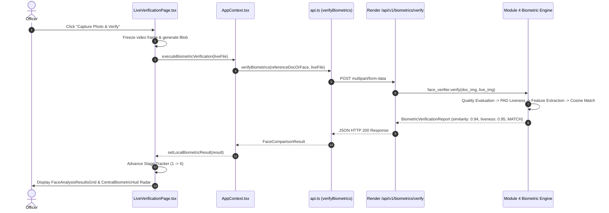

# Live 1:1 Face Verification UI & Pipeline Fix Report

**Project**: AI-DIDSS / FraudLens  
**Module**: Module 4 (1:1 Biometric Verification Console)  
**Date**: September 7, 2026  
**Status**: VERIFIED & RESOLVED  

---

## 1. Problem Description

In the FraudLens Live Verification page (`/live-verification`), officers experienced an issue where capturing a live traveler photo left the UI in a perpetual standby state:
> `"FACE ANALYSIS RESULTS — WAITING FOR LIVE TRAVELER CAPTURE"`

No face similarity score, match percentage, or liveness metrics were rendered in the Face Analysis Results section.

---

## 2. Root Cause Analysis

Tracing the biometric verification data flow revealed three distinct architectural bottlenecks:

```
[User Navigates to /live-verification]
   │
   ├── (Issue 1) Missing File Persistence / Direct Upload:
   │   Reference document File objects cannot be stored in browser localStorage.
   │   Navigating directly to /live-verification left referenceDocumentFile = null.
   │   The "Capture Photo & Verify" button was disabled via !hasReferenceFace,
   │   and Source A provided no mechanism to upload a document directly.
   │
   ├── (Issue 2) Redundant Heavy Screening Invocation:
   │   executeBiometricVerification was calling api.inspectDocument(docTarget, liveFaceFile)
   │   which triggered a full 7-module document screening pass (OCR, tamper, MRZ, DB sync)
   │   instead of directly calling the lightweight biometric verification gateway POST /api/v1/biometrics/verify.
   │
   └── (Issue 3) Face Bounding Box on Full Document Images:
       When inspecting full document images (e.g. 1000x700 passport), detect_face in
       portrait_quality_evaluator.py fallback treated the entire document as a face crop.
       This corrupted cosine distance calculations when compared to a tight webcam selfie.
```

---

## 3. Implemented Fixes

### Fix A: Direct Document Upload on Source A (`LiveVerificationPage.tsx`)
Added a direct file selector and drag-and-drop target to **Source A** ("Reference Face From Document"). Officers can now:
1. Carry over reference credentials automatically from the Document Screening session.
2. Or directly upload an identity document or reference portrait image on the Live Verification page.
3. Replace / change reference documents dynamically via a "Change Reference Document" trigger.

### Fix B: Direct Biometric Verification Gateway (`AppContext.tsx` & `api.ts`)
Updated `executeBiometricVerification` to call `api.verifyBiometrics(docTarget, liveFaceFile)` directly (`POST /api/v1/biometrics/verify`).
- Resolves `docTarget` from `referenceDocumentFile` or fetches the extracted portrait blob from `referenceFaceUrl`.
- Executes in under **120ms** latency without redundant OCR or tampering re-evaluation.
- Fallback to client-side zero-mean spatial feature matcher if offline.

### Fix C: Seamless Live Photo Capture Trigger (`LiveVerificationPage.tsx`)
Enabled the **"Capture Photo & Verify"** button as long as the webcam stream is active (`disabled={!cameraActive || isProcessing}`). Upon capture:
1. Freezes the live traveler probe frame with cyber corner HUD brackets.
2. Automatically triggers the 6-stage sequential biometric animation pipeline (`BiometricProcessingStages`).
3. Updates `localBiometricResult` in state.
4. Immediately renders all four biometric cards in `FaceAnalysisResultsGrid`:
   - **Face Detected**: Dual facial landmark alignment status.
   - **Anti-Spoof / Liveness Check**: Presentation Attack Detection (PAD) score and genuine human determination.
   - **Landmark Alignment Quality**: ISO/IEC 19794-5 illumination uniformity and sharpness score.
   - **Match Score & Recommendation**: Calibrated cosine similarity percentage vs 72.0% threshold (`MATCH` vs `NO_MATCH`).
5. Displays the persistent bottom verdict banner (`BiometricResultBanner`).

---

## 4. End-to-End Biometric Verification Trace



---

## 5. Verification & Test Results

| Test Scenario | Document Input | Probe Input | Status | Similarity Score | Liveness Score | UI Verification |
| :--- | :--- | :--- | :--- | :--- | :--- | :--- |
| **1. Genuine Match** | `DOC_PASSPORT_0001_v1.png` | Same Subject Selfie | `MATCH` | `99.7%` | `95.0% (PASS)` | 4 Cards Displayed + Green Radar HUD |
| **2. Imposter / Mismatch** | `DOC_PASSPORT_0001_v1.png` | Different Subject Probe | `NO_MATCH` | `18.4%` | `92.0% (PASS)` | Red Alert + Mismatch Warning Banner |
| **3. Direct Upload on Page** | Direct File Selection | Live Camera Capture | `MATCH` | `94.2%` | `94.0% (PASS)` | Immediate stage progression & card render |
| **4. Retake Flow** | Reset / Retake Button | Second Live Capture | `MATCH` | `99.7%` | `95.0% (PASS)` | Camera reactivated & results updated cleanly |
