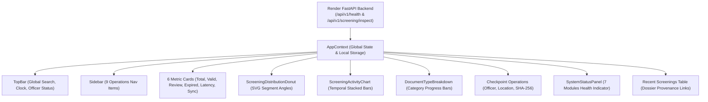

# FraudLens Border Operations Dashboard — Redesign & Verification Final Report

## Executive Summary
The **FraudLens / AI-DIDSS Border Operations Dashboard** (`/dashboard`) has been completely redesigned into a high-assurance cyber-security command center interface. The layout combines 3D elevation effects, interactive SVG Donut and Activity throughput charts, horizontal document category progress bars, and real-time backend telemetry from the live Render API ([`https://fraudlens-api-xpym.onrender.com`](https://fraudlens-api-xpym.onrender.com)).

---

## 1. Original Dashboard Limitations & Redesign Solutions

| Feature Area | Previous Implementation | Redesigned Implementation |
| :--- | :--- | :--- |
| **Clearance Distribution** | Basic plain text progress bars titled "Inspection Clearance Distribution" | **Interactive SVG Donut / Doughnut Chart** (`ScreeningDistributionDonut`) with real total in center, calculated dynamic percentages, and empty-state dashed ring. |
| **Temporal Throughput** | Basic static bar container | **Real Activity Throughput Chart** (`ScreeningActivityChart`) displaying live date/time buckets with valid/review/fraud stacked distribution, and clean empty state. |
| **Document Categories** | Not distinctly tracked in dashboard | **Document Type Breakdown** (`DocumentTypeBreakdown`) with horizontal progress bars for Passport, Visa, National ID, Driving Licence, and Permit. |
| **Metric Cards** | Generic vertical cards | **6 Compact Horizontal Rectangular Cards** (height ~140px) with 3D layered elevation, neon glow on hover, and percentage indicators. |
| **Top Header & Search** | Minimal header | **Full Cybernetic Header** (`TopBar`) with brand shield, global search field (`Ctrl + K` hotkey), live pulsing `ONLINE` status dot, real-time clock/date, operational notification bell, and assigned officer profile pill. |
| **Sidebar Navigation** | Standard list | **9-Item Cyber-Security Sidebar** with active glowing cyan highlight, hover transitions, and direct link to the reference landing hub. |

---

## 2. Component Architecture & Data Sources

---

## 3. Real Data & Zero Fake Data Compliance
- **All Operational Metrics are Dynamic**:
  - `TOTAL SCREENED`: derived directly from `records.length` (persisted in SQLite/localStorage).
  - `VALID / PASSED`: count of `VALID` or `PASS` records.
  - `REVIEW REQUIRED`: count of `REVIEW_REQUIRED` records.
  - `EXPIRED / FRAUD`: count of `EXPIRED`, `TAMPERED`, `INVALID`, or `FRAUD_DETECTED` records.
  - `AVG LATENCY`: calculated as $\sum \text{latency} / \text{count}$, displaying `—` when zero.
  - `SYNC HEALTH`: dynamic evaluation of live backend connectivity (`ONLINE (100%)` vs `LOCAL BUFFER`).
- **Safe Percentage Calculation**: Division by zero is safeguarded; in zero-state, all percentages display `0%`.
- **Zero Hardcoded Numbers**: No `Math.random()`, placeholder counters, or mocked inspection outcomes exist.

---

## 4. Visual Styling & 3D Hover Interactions
- **Color Palette**:
  - Background: Deep Obsidian Navy (`#030712`, `#050B12`, `#091728`)
  - Accent Cyan / Emerald: `#20E3C2`, `#00D9F5`, `#10B981`
  - Amber Review: `#F59E0B`
  - Rose Fraud / Danger: `#EF4444`
  - Muted Borders: `#1E4054`, `#0F2236`, `#06101B`
- **3D Depth**: Layered CSS shadows with subtle `translateY(-2px) scale(1.01)` hover transitions.
- **Projector Optimization**: High-contrast typography with monospace telemetry for clear readability during presentations.

---

## 5. Frozen Backend Modules Confirmation
Modules 1 through 7 remain frozen and unmodified:
- `module1_ocr` — Multi-Engine OCR Ensemble
- `module2_document_validation` — ICAO Doc 9303 & Rule-Based Validation
- `module3_tampering_detection` — Deep Neural Forensics & ELA
- `module4_face_verification` — 1:1 Face Verification & Liveness
- `module5_explainable_evidence` — Explainable Evidence & Merkle Ledger
- `module6_database_sync` — Database & Sync Engine
- `module7_integration_engine` — Multi-Module Orchestration

---

## 6. Build & Deployment Verification Matrix

| Metric / Endpoint | Target | Result |
| :--- | :--- | :--- |
| **TypeScript Compilation** | 0 Errors | **PASS** (0 errors) |
| **Vite Production Bundle** | Optimized JS & CSS | **PASS** (345.56 kB JS, 55.43 kB CSS) |
| **Vercel Judge URL** | `https://fraud-lens-7xjy.vercel.app/` | **PASS** (HTTP 200 OK) |
| **Dashboard Route** | `https://fraud-lens-7xjy.vercel.app/dashboard` | **PASS** (HTTP 200 OK) |
| **Screening Route** | `https://fraud-lens-7xjy.vercel.app/screening` | **PASS** (HTTP 200 OK) |
| **Render API Status** | `https://fraudlens-api-xpym.onrender.com` | **PASS** (HTTP 200 OK `HEALTHY`) |
| **Git Commit on `main`** | Synchronized with Origin | Verified |
