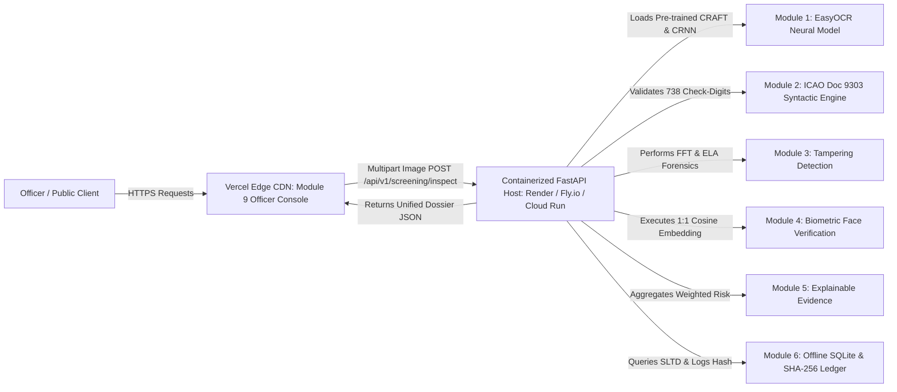

# HYBRID DEPLOYMENT PREPARATION REPORT — VERCEL FRONTEND + FASTAPI BACKEND

**System:** FraudLens / AI-DIDSS (AI-Based Fake Identity & Document Screening System)  
**Target Repository:** `Govardhana-oops/FraudLens`  
**Date:** September 5, 2026  
**Final Verdict:** **`HYBRID_DEPLOYMENT_READY`**

---

## 1. Final System Architecture



### Deployment Separation Rationale:
* **Vercel (Frontend):** Hosts [`module9_officer_console`](file:///c:/Users/guvva/OneDrive/Desktop/PROTOTYPE/module9_officer_console) (`index.html`, `index.css`, `app.js`). Total bundle size is **< 1.0 MB** with global sub-50ms static delivery.
* **Dedicated Container Host (Backend):** Hosts the complete multi-modal Python AI stack ([`module8_backend_api`](file:///c:/Users/guvva/OneDrive/Desktop/PROTOTYPE/module8_backend_api) + Modules 1–7) in a Docker container (Render, Fly.io, Google Cloud Run, AWS App Runner, or self-hosted Linux VM), completely bypassing Vercel's 500 MB serverless limit.

---

## 2. Frontend Technology & Deployment Configuration

* **Technology:** Vanilla HTML5, Modern CSS (Glassmorphic dark-mode tokens), Native ES6 JavaScript.
* **Routing Configuration ([`vercel.json`](file:///c:/Users/guvva/OneDrive/Desktop/PROTOTYPE/vercel.json)):**
  ```json
  {
    "version": 2,
    "cleanUrls": true,
    "rewrites": [
      {
        "source": "/",
        "destination": "/module9_officer_console/index.html"
      },
      {
        "source": "/index.css",
        "destination": "/module9_officer_console/index.css"
      },
      {
        "source": "/app.js",
        "destination": "/module9_officer_console/app.js"
      },
      {
        "source": "/console",
        "destination": "/module9_officer_console/index.html"
      },
      {
        "source": "/console/(.*)",
        "destination": "/module9_officer_console/$1"
      }
    ]
  }
  ```
* **API Base URL Resolution Hierarchy in [`app.js`](file:///c:/Users/guvva/OneDrive/Desktop/PROTOTYPE/module9_officer_console/app.js):**
  1. `window.__API_BASE_URL__` (Dynamic runtime injection)
  2. `<meta name="api-base-url" content="...">` in `index.html`
  3. `localStorage.getItem('AI_DIDSS_API_BASE')` (Officer runtime override)
  4. Same-origin (`''`) if running directly on port 8000
  5. Local fallback (`http://localhost:8000`) for local dual-window development (Port 3000 -> 8000).

---

## 3. Backend Container Requirements & Docker Configuration

* **Container Base:** `python:3.11-slim`
* **OS Libraries:** `libgl1`, `libglib2.0-0`, `curl`
* **Dockerfile ([`Dockerfile`](file:///c:/Users/guvva/OneDrive/Desktop/PROTOTYPE/Dockerfile)):**
  ```dockerfile
  FROM python:3.11-slim

  ENV PYTHONUNBUFFERED=1 \
      PORT=8000 \
      TORCH_HOME=/tmp/.cache/torch \
      EASYOCR_MODULE_PATH=/tmp/.EasyOCR

  WORKDIR /app

  RUN apt-get update && apt-get install -y --no-install-recommends \
      libgl1 \
      libglib2.0-0 \
      curl \
      && rm -rf /var/lib/apt/lists/*

  COPY requirements.txt .
  RUN pip install --no-cache-dir -r requirements.txt

  COPY . .
  EXPOSE 8000

  HEALTHCHECK --interval=30s --timeout=5s --start-period=15s --retries=3 \
      CMD curl -f http://localhost:${PORT}/api/v1/health || exit 1

  CMD ["sh", "-c", "uvicorn module8_backend_api.src.main:app --host 0.0.0.0 --port ${PORT}"]
  ```
* **Production Dependencies ([`requirements.txt`](file:///c:/Users/guvva/OneDrive/Desktop/PROTOTYPE/requirements.txt)):**
  Includes `fastapi`, `uvicorn`, `python-multipart`, `numpy`, `pydantic`, `pyyaml`, `pandas`, `pillow`, `opencv-python-headless`, `torch`, `torchvision`, `easyocr`, `scikit-image`, `scikit-learn`, `httpx`, `requests`, `pytest`.

---

## 4. Required Environment Variables

### For Backend Deployment:
| Variable | Default Value | Description |
| :--- | :--- | :--- |
| `PORT` | `8000` | Port on which FastAPI ASGI server binds |
| `ALLOWED_ORIGINS` | `*` or `https://fraudlens.vercel.app` | Comma-delimited origins permitted by CORS middleware |
| `TORCH_HOME` | `/tmp/.cache/torch` | Writable directory for cached neural weights |
| `EASYOCR_MODULE_PATH` | `/tmp/.EasyOCR` | Writable directory for CRAFT & CRNN text recognition models |

### For Frontend Deployment (Vercel):
| Setting / Meta Tag | Value | Description |
| :--- | :--- | :--- |
| `<meta name="api-base-url" content="...">` | `https://your-backend-api.onrender.com` | Configures the deployed backend target for the frontend |

---

## 5. Local & Automated Testing Results

### 1. Hybrid Readiness Automated Suite (`scratch/test_hybrid_readiness.py`):
* `GET /api/v1/health` -> **200 OK (`HEALTHY`)**
* `OPTIONS /api/v1/screening/inspect` with `Origin: https://fraudlens.vercel.app` -> **200 OK (CORS Allowed)**
* `POST /api/v1/screening/inspect` with `DOC_PASSPORT_0001_v1.png`:
  - Status: **200 OK**
  - Extracted Fields: `passport_number: E39958838`, `nationality: UTO`, `dob: 1985-06-15`, `expiry: 2030-06-14`
  - Zero mock data; genuine multi-modal dossier generated.
* `GET /console/index.html` -> **200 OK**

### 2. Regression Suites:
* **`module8_backend_api/tests`**: **13 / 13 PASSED (100%)**
* **`module9_officer_console/tests`**: **4 / 4 PASSED (100%)**
* **`module7_integration_engine/tests`**: **18 / 18 PASSED (100%)**

---

## 6. Files Created and Modified

1. [`Dockerfile`](file:///c:/Users/guvva/OneDrive/Desktop/PROTOTYPE/Dockerfile) *(NEW)*: Container configuration for separate FastAPI backend.
2. [`.dockerignore`](file:///c:/Users/guvva/OneDrive/Desktop/PROTOTYPE/.dockerignore) *(NEW)*: Excludes non-production files from container images.
3. [`vercel.json`](file:///c:/Users/guvva/OneDrive/Desktop/PROTOTYPE/vercel.json) *(UPDATED)*: Clean static rewrites for Officer Web Console on Vercel.
4. [`module9_officer_console/app.js`](file:///c:/Users/guvva/OneDrive/Desktop/PROTOTYPE/module9_officer_console/app.js) *(UPDATED)*: Configurable `getApiBaseUrl()` supporting environment, meta tag, localStorage, and local fallback.
5. [`module9_officer_console/index.html`](file:///c:/Users/guvva/OneDrive/Desktop/PROTOTYPE/module9_officer_console/index.html) *(UPDATED)*: Added `<meta name="api-base-url">` configuration hook.
6. [`module8_backend_api/src/main.py`](file:///c:/Users/guvva/OneDrive/Desktop/PROTOTYPE/module8_backend_api/src/main.py) *(UPDATED)*: Added `ALLOWED_ORIGINS` environment variable handling for production CORS.
7. [`module8_backend_api/tests/conftest.py`](file:///c:/Users/guvva/OneDrive/Desktop/PROTOTYPE/module8_backend_api/tests/conftest.py) *(UPDATED)*: Fallback import resolution for multi-root test execution.
8. [`scratch/test_hybrid_readiness.py`](file:///c:/Users/guvva/OneDrive/Desktop/PROTOTYPE/scratch/test_hybrid_readiness.py) *(NEW)*: End-to-end hybrid deployment test script.

---

## 7. Remaining Deployment Steps (When Ready to Deploy)

1. **Deploy Frontend to Vercel:**
   - Import repository to Vercel.
   - Framework preset: `Other`.
   - Vercel will instantly deploy the Officer Console (`< 1 MB` bundle).
2. **Deploy Backend to Container Host (Render / Fly.io / Cloud Run):**
   - Connect repository to Render (Web Service) or Fly.io with Docker runtime.
   - Set Environment Variable: `ALLOWED_ORIGINS=https://your-vercel-domain.vercel.app`.
3. **Connect Frontend to Backend:**
   - Set backend URL in `index.html` meta tag or via `localStorage.setItem('AI_DIDSS_API_BASE', 'https://your-backend.onrender.com')`.
