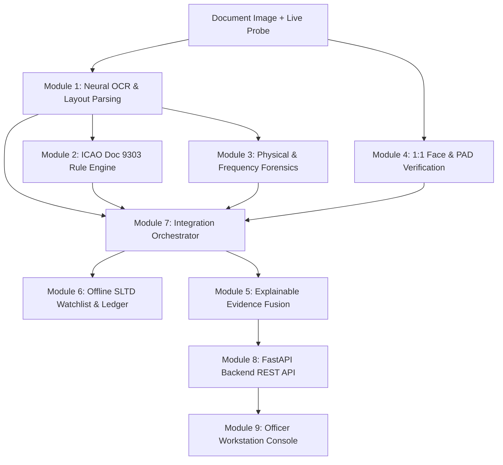

# FraudLens (AI-DIDSS) 🛡️

**AI-Based Fake Identity & Travel Document Screening Decision Support System**

[](https://fastapi.tiangolo.com)
[](https://www.python.org)
[](https://vercel.com)
[](https://streamlit.io)
[](LICENSE)

FraudLens (AI-DIDSS) is a mission-critical, multi-modal screening decision support system engineered for border control checkpoints, immigration authorities, and high-security identity verification stations. It combines neural OCR, ICAO Doc 9303 checksum validation, physical tampering forensics, 1:1 biometric facial comparison, and a tamper-evident SHA-256 audit ledger into a single explainable screening dossier.

---

## 🏛️ System Architecture



### Modular Pipeline Overview:
* **Module 1 (OCR):** Universal neural OCR engine with layout-aware spatial token tracking.
* **Module 2 (Syntactic Validation):** ICAO Doc 9303 TD1/TD2/TD3 MRZ parser with 738 check-digit validation algorithms.
* **Module 3 (Tampering Detection):** Frequency spectrum (FFT), Error Level Analysis (ELA), and copy-move forensic anomaly detection.
* **Module 4 (Biometric Verification):** 1:1 facial probe-to-document portrait embedding cosine similarity and Presentation Attack Detection (PAD).
* **Module 5 (Explainable Evidence):** Weighted multi-dimensional risk aggregation and actionable officer recommendations (`CLEAR`, `REVIEW_REQUIRED`, `SECONDARY_INSPECTION_REQUIRED`).
* **Module 6 (Database & Sync):** Sub-millisecond offline SLTD watchlist lookup and immutable SHA-256 chained audit journal.
* **Module 7 (Integration Engine):** End-to-end multi-modal pipeline coordinator.
* **Module 8 (Backend API):** High-throughput FastAPI REST service.
* **Module 9 (Officer Console):** Dark-mode glassmorphic 3-column workstation interface.

---

## 🚀 Deployment Options

### 1. Vercel Deployment (FastAPI Production Backend)
FraudLens is pre-configured for instant Vercel serverless deployment.

* **Entrypoint:** [`api/index.py`](api/index.py) (Routes to [`module8_backend_api/src/main.py`](module8_backend_api/src/main.py))
* **Configuration:** [`vercel.json`](vercel.json) maps all incoming routes (`/(.*)`) to `api/index.py`.
* **API Documentation:** Interactive Swagger UI at `/docs` and ReDoc at `/redoc`.

#### Deploy to Vercel:
1. Import `Govardhana-oops/FraudLens` on [vercel.com](https://vercel.com).
2. Keep default settings (`Framework: Other`, `Root Directory: ./`).
3. Deploy!

---

### 2. Streamlit Community Cloud (Standalone Console)
The full 3-column cybersecurity workstation console can be deployed directly to Streamlit Cloud.

* **Main file path:** `streamlit_app.py`
* **Python Version:** Set to `3.11` or `3.12` under *Advanced Settings*.
* **URL:** Deploy via [share.streamlit.io](https://share.streamlit.io).

---

### 3. Local Workstation Launch

#### Option A: One-Click Windows Launcher
Double-click [`START_SYSTEM.bat`](START_SYSTEM.bat) to boot both the FastAPI backend and the Officer Web Console simultaneously.

#### Option B: Manual CLI Launch
```bash
# 1. Install dependencies
pip install -r requirements.txt

# 2. Start FastAPI Backend (Port 8000)
uvicorn module8_backend_api.src.main:app --host 0.0.0.0 --port 8000 --reload

# 3. Access Officer Console
# Open module9_officer_console/index.html in any modern browser
# or navigate to http://localhost:8000/console
```

---

## 📡 Core API Endpoints

| Method | Endpoint | Description |
| :--- | :--- | :--- |
| `GET` | `/api/v1/health` | Health check, uptime, and sub-module readiness. |
| `POST` | `/api/v1/screening/inspect` | Multipart upload for document & live probe inspection. |
| `GET` | `/api/v1/watchlist/check/{doc_number}` | Sub-millisecond offline stolen/revoked watchlist query. |
| `GET` | `/api/v1/audit/logs` | Query tamper-evident audit logs with cryptographic chain verification. |
| `POST` | `/api/v1/sync/differential` | Two-way differential database synchronization. |

---

## 🧪 Testing & Verification

Run the automated test matrix across all modules:

```bash
# Run Module 8 API test suite
pytest module8_backend_api/tests -v

# Run Module 7 Integration test suite
pytest module7_integration_engine/tests -v

# Run full system test matrix
pytest
```

---

## 🔒 Security & Compliance
* **Zero-Hallucination Policy:** Strict uncertainty handling with transparent confidence bounds.
* **Tamper-Evident Ledger:** Every screening event is recorded in a contiguous SHA-256 hash-chained journal.
* **Air-Gap Capability:** Fully operational offline without persistent external cloud dependencies.
